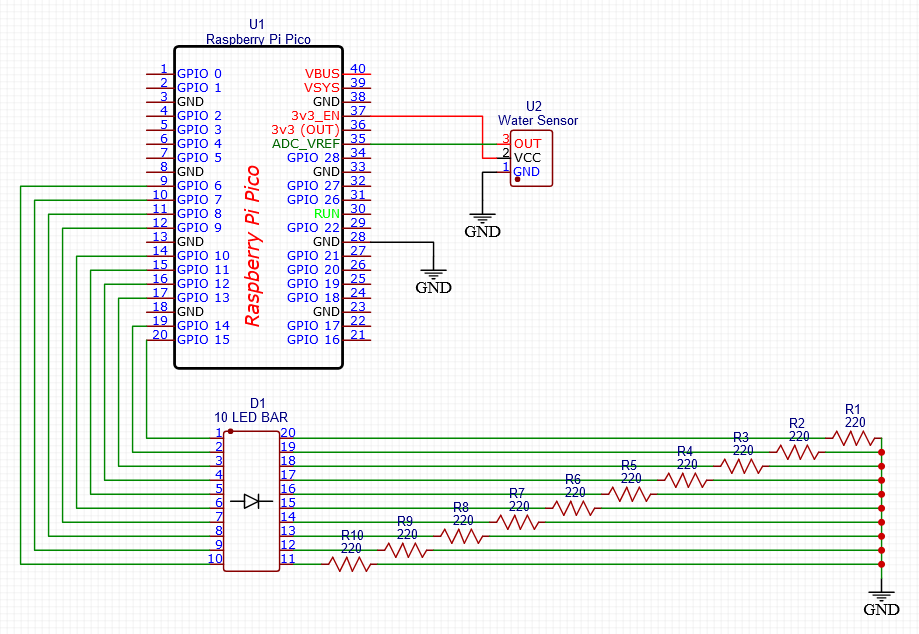

# Raspberry Pi Pico - Plant Water Level Indicator

A basic one-day project to add a water level indicator to my pothos vining plant.

## Motivation
I had a few parts lying around: [raspberry pi pico](https://www.adafruit.com/product/5525), [water level sensor](https://www.adafruit.com/product/4965), and [LED bar](https://www.adafruit.com/product/1921) - I thought they could be used to make a simple visual reminder to water my plant.

## Setup
Please check out this [getting started with the pico](https://projects.raspberrypi.org/en/projects/getting-started-with-the-pico/0) tutorial from raspberry pi to blink the onboard LED and to save this project's `main.py` script onto the pi pico.

The breadboard can be wired based on this schematic.

**NOTE** - any GPIO pins can be used for the 10 LED bar pins, but the OUT pin for the water sensor must be wired to any of the 5 ADC pins on the pi pico ([documentation](https://www.raspberrypi.com/documentation/microcontrollers/raspberry-pi-pico.html))

## Code Explanation
To test the water level sensor I looked at the output numbers in the following environments:
- **water** - range of 15k to 30K
- **soil** - range of 15k to 25k

The soil range just so happened to divide into 10 roughly equal 1k parts from 15k to 25k. I divided the output value by 1k and determined how many LEDs to turn on based on that reading, which happens every half second.

## License
[MIT](LICENSE)
